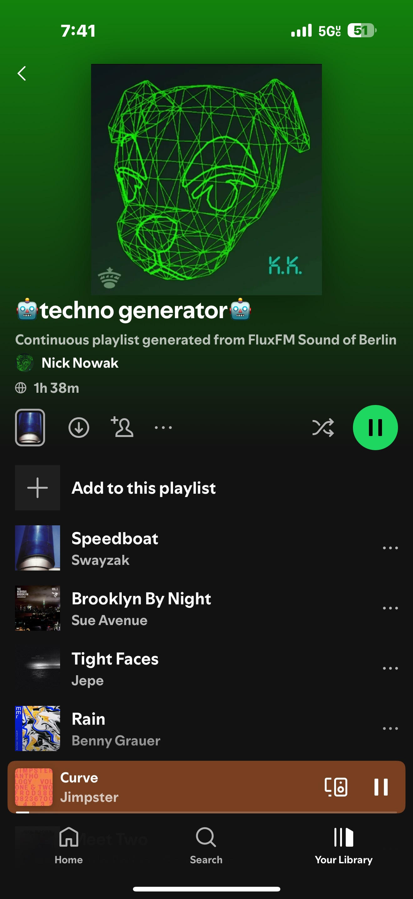

  # Overview
  Scrapes some of my favorite techno stations in a polite way to create a list of songs I missed. 
  
  One script creates the text file, the other uploads the songs to a spotify playlist. 
  
  Turn both scripts on and they will continuously upload new techno songs to a spotify playlist. 
  
  You'd need to populate your own CLIENT_ID and SECRET_ID found in the developer dashboard for Spotify.
  
  This code is entirely generated by AI, but required a lot of back-and-forth to work.
  
  [Listen to the playlist!](https://open.spotify.com/playlist/3Oof1Q9vwZpJrj0L9ohkOc)
  
  

